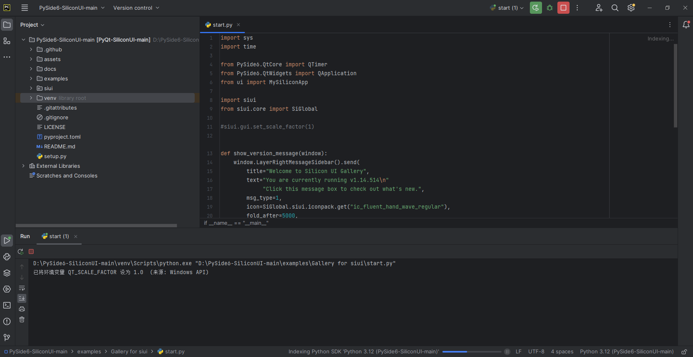

# PySide6-SiliconUI

#### 转载说明
此项目为Aqqu大佬修改，原地址：https://gitee.com/aqquchina/py-side6-silicon-ui
为方便Github用户拉取仓库，故将仓库上传Github，如需删库请告知我，谢谢

#### 介绍
这是用PySide6写的一个GUI，基于github上ChinaIceF大佬的开源项目修改而来，主要是为了让Pyside6的用户方面使用。减少重复去修改代码，主要是pyside6可商用！

#### 软件架构
基于pyside6开发而来

#### 安装教程

下载该仓库，在命令行中输入以下命令：
1.  `python setup.py install`

#### 使用说明

安装完以后，可以在pycharm中打开该项目下的examples/Gallery for siui/目录下的start.py，运行即可看到如下面演示效果图一样

#### 参与贡献

1.  参考大佬github的源码地址：https://github.com/ChinaIceF/PyQt-SiliconUI

## 演示图

#### 特别声明

用户阅读、下载、基于该软件开发或修改该软件，即代表用户已经理解并同意开源许可证声明的权利与限制，用户理解并同意不进行违反当地法律法规的开发或/和修改，若因用户的开发或/和修改违反了当地的法律，或是用户的开发或/和修改的传播和使用过程中违反了传播者和使用者所在地区适用的法律，或是造成了任何负面的个人或公众影响，用户应承担全部责任，本软件的开发者不承担任何责任。
